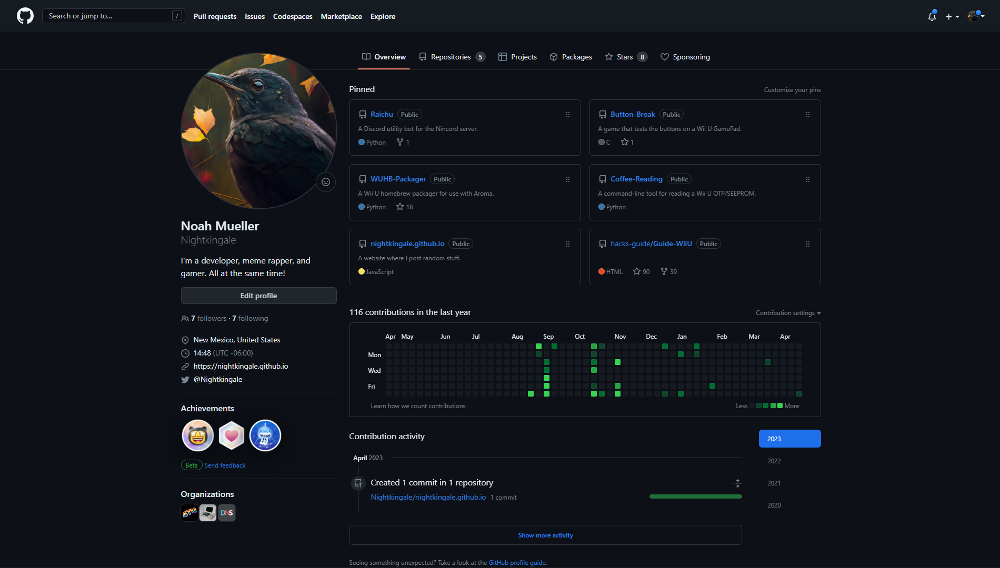
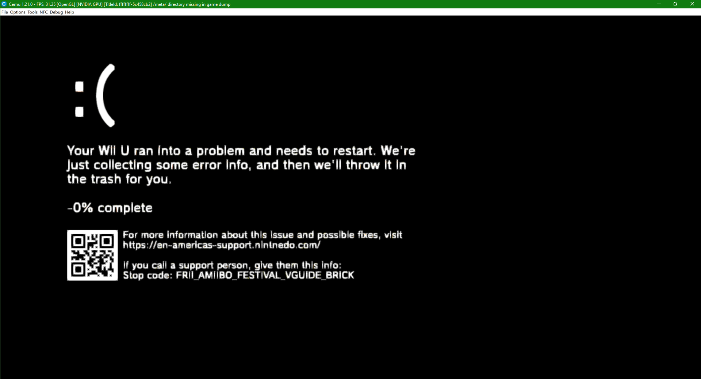

In summary, this website is a small project of mine which will have a bunch of random information I deem fun enough to have on here.

In the [Posts](../posts) part of the website, I'll be writing blog posts about whatever I feel like. I wouldn't expect posts too often, but I'll try my best to make each one an interesting read.

If you're interested in learning how I made this website, the [Source](https://github.com/Nightkingale/Personal-Website) link in the navigation bar will take you to its GitHub repository. You can also click the [Discord](https://discord.gg/mYjeaZQ) link to join my server, Nincord. It's probably the best way to reach me.

> 

## Introduction

A lot of people know me for my work in the video-game modding scene. In particular, I'm probably most notable for my former presense in the [Nintendo Homebrew](https://discord.gg/C29hYvh) server (which I wrote a song about) or as a team member of the [ForTheUsers](https://fortheusers.org/) organization.

I've actually always been interested in computers from a very young age. I enjoyed video-games, and just like everyone else nowadays, I rely on technology for my day-to-day duties. All in all, I'd argue that my life has always revolved around computers.

When the coronavirus pandemic hit back in 2020, like everyone else, my life was changed.

I began to pick up programming as a hobby during lockdown. I taught myself the basics of Python, and even today I'm continuing to refine those skills throughout my work.

I also became interested in tinkering with video-game consoles, primarily the Nintendo Wii U. I spent a lot of time learning how the console worked, and I would teach others online through Discord how to modify their own consoles. I used to even be a writer for the holy bible of Wii U modding, the [Wii U hacking guide](https://wiiu.hacks.guide)!

Along the way, I met great friends who still support me today, like [GaryOderNichts](https://github.com/GaryOderNichts), [Lazr1026](https://github.com/Lazr1026), and [NicoAICP](https://github.com/NicoAICP). I also have a Discord server filled with even more amazing people, and I'm so happy to have met each and every one of them.

## Current Work

Nowadays, I spend most of my time researching the Wii U and its backwards-compatibility mode (which many call the vWii). The original Wii is very nostalgic to me, and I love experimenting with it to find out new things that many people overlook. Its games are amazing, and the hardware is just so innovative!

Nintendo obviously doesn't intend for people to mod their consoles, but I only see it as an advantage to rebel against them. They don't really listen to us anyway...

> 

## Current Projects

Besides this website, my currently supported projects are as follows:

* [Raichu](https://github.com/Nightkingale/Raichu), a Discord utility bot for the Nincord server.
* [Button Break](https://github.com/Nightkingale/Button-Break), a game that tests the buttons on a Wii U GamePad. 
* [WUHB Packager](https://github.com/Nightkingale/WUHB-Packager), a Wii U homebrew packager for use with Aroma.
* [Coffee Reading](https://github.com/Nightkingale/Coffee-Reading), a command-line tool for reading a Wii U OTP/SEEPROM.

I have many more ideas for projects in the future, so be sure to keep checking out this website and my social medias for more information!