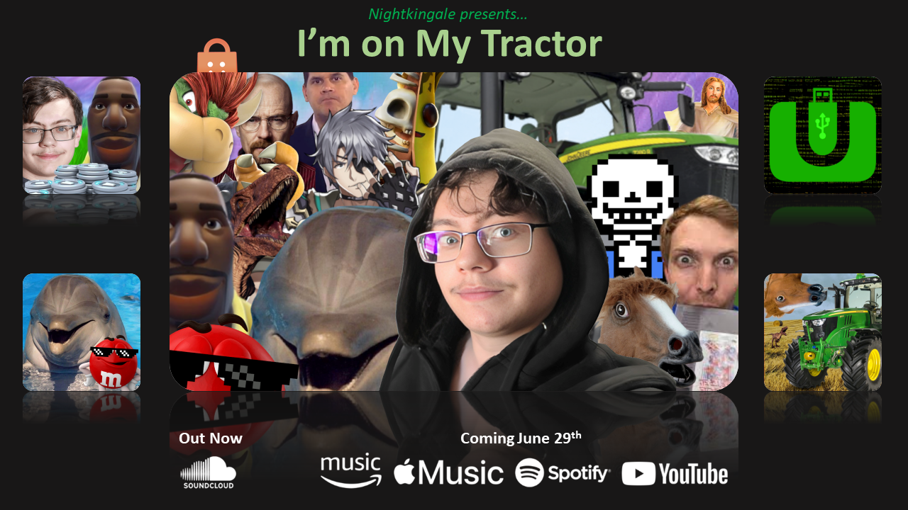
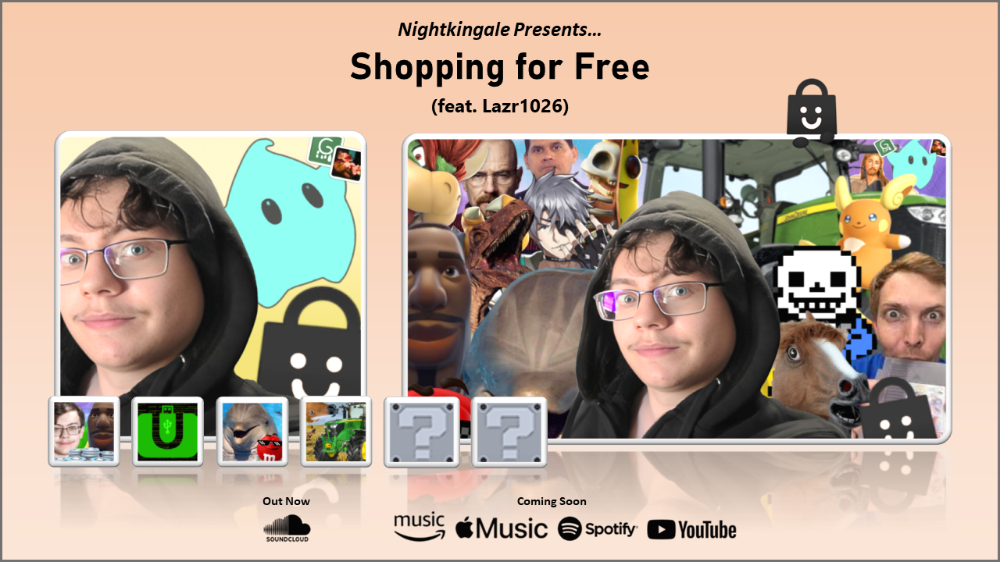
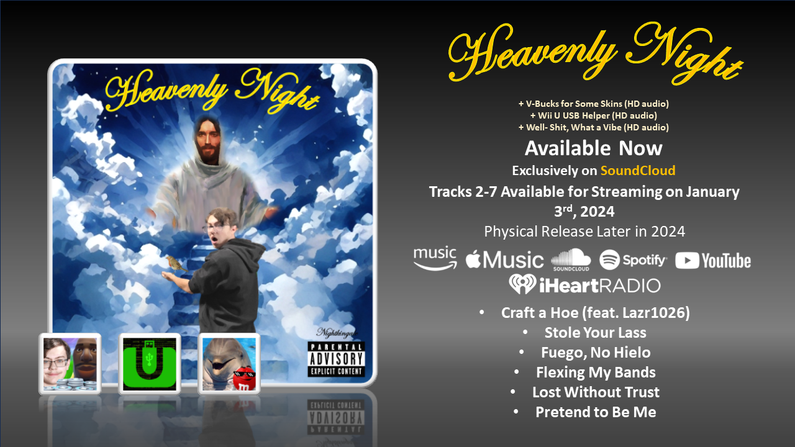

# Nightkingale's Heavenly Era

This is a follow-up to my last post, [Origin Story of Nightkingale](./origin-story-of-nightkingale.md). If you haven't read it yet, you should! It gives you insight on the first three tracks, which I used to call the *Meme Trilogy*. This time, however, I'll talk about my more recent tracks, "I'm on My Tractor," "Shopping for Free," and the upcoming *Heavenly Night* album.

## During the Break

If you ended up reading the last post, you'll find out I originally took a short break (much shorter than the "break" I've been taking this time around, albeit) after I released "Well Shit, What a Vibe." Initially, I only wanted to release three songs.

I hit a roadblock pretty quickly when coming up with new ideas, so I couldn't see me making much else. I didn't mention this last time, but I actually went through multiple drafts for "Well Shit, What a Vibe," including one draft which would eventually turn into another track entirely, called "Counting My Bands."

After the positive reception I received for the first three songs, I decided maybe I would really try and come back with some new songs. I spent a few weeks thinking and producing beats, and I eventually came up with plans for four tracks.

* "I'm on My Tractor," because I wanted to produce a country beat.
* "Stole Your Lass," which was meant to be the "heavy hitter" of the four.
* A track about Elon Musk, with inspiration from some of my drafts at the time.
* "Shopping for Free," particularly because I wanted a Wii U USB Helper sequel.

As you know, only three of these tracks actually ended up getting attention, one of which was held back due to some time conflicts. One of these hasn't even ~~yet~~ become any more than just an idea.

I decided to call this plan *Meme Trilogy Deluxe* back then. Behind the scenes though, I have categorized my music into "generations" or "eras" per say. Anything from "V-Bucks for Some Skins" to *Heavenly Night* has been retroactively dubbed the Heavenly Era (or Generation 1). Anything after (spoilers if you read this before 2024, there will be more,) will be Generation 2.

### I'm on My Tractor

> I live in the west, and I do love tractors. (06/28/2023)

I began working on this one pretty early on. I have always had the idea of some sort of country track, and I thought it'd be funny to make a comeback with one. I wasn't initially sure what to call it, so during production, I labeled it "Tractero."

Why? Before *Heavenly Night*, I gave my beats dumb names before using them for tracks.

* "V-Bucks for Some Skins" was "Bucko."
* "Wii U USB Helper" was "Helpo."
* "Well Shit, What a Vibe" was "Vibeo."
* "I'm on My Tractor" was, of course, "Tractero."
* "Shopping for Free" would result from "Shoppo."

I don't do this anymore, but it was fun back then! I would make these "codenames" public on my Discord server to give out hints for as what the next song would be.

As for the track itself, it was very country-like, down to the lyrics being incredibly dumb. No hate though, I love country! I felt like it's a balanced mix between a country song (with the tractor theme and plowing fields and whatnot) and my own style of writing (with the velociraptor and plowing... well, hoes). I also got my little brother to give a shoutout to velociraptors at the end.

Fun fact too, this is when I introduced the concept of early drops for my music! Before, everybody would hear my music at the same time because it dropped on all platforms simultaneously. Starting with this track, I would release it on SoundCloud particularly early so people most involved in my music could hear it before an official release. I have been keeping this pattern ever since, but I'm not sure if I'll continue doing it after *Heavenly Night*. We'll see!

* "I'm on My Tractor" was early dropped on June 16th, 2023.
* "Shopping for Free" would be early dropped on July 5th, 2023.

### Shopping for Free

> You can't pirate just once, so how about twice? (07/19/2023)

"Shopping for Free" was completed way quicker than I ever anticipated, in fact, it took the shortest amount of time for me to write this track out of all. Usually, a track will have a beat produced at least months in advance, and will only become more than an idea when I write good lyrics for it.

"Shopping for Free," from conceptualization to finalization, I think took only about a week to complete.

The reason for this is because I brought some others on board to help with the track. Two people in particular, one of course being [Lazr1026](https://github.com/Lazr1026) (who technically got their musical debut here). The other wished to not be credited for helping with this track, so I'm respecting their wishes. That being said, I'm sure you can guess who, as they are very clearly referenced on the single.

I wanted a sequel for "Wii U USB Helper," as it's my most popular track, and probably my favorite too. This time, I decided to focus particularly on the Nintendo 3DS homebrew scene, of which I have little knowledge about compared to the Wii U one.

### Heavenly Night

> I'm making my way to find Jesus. (01/03/2024)

*Heavenly Night* has been a concept I've had ever since I started. In fact, I kind of refer to it in "Well Shit, What a Vibe." This is the album where I'm going to meet Jesus, become a God, get some girls, and make it big!

I started officially working on this album the very day after "Shopping for Free" released, but you might say I've been working on it even longer than that (if you count my first attempt at an album). I intentionally stayed very quiet about working on the album, because last time I worked on an album, I made too many promises I wouldn't be able to live up to.

I worked with Lazr again, who would help me with some of the writings and would listen to some of the beats I made. We even brought on board an outside producer, [Maribitt](https://www.youtube.com/@Deerladymar), to help with the production of a track. It was a pleasant experience, and I hope to bring her back in the future as I continue making my music.

I first started off with the intro track, of course called "Heavenly Night." I absolutely loved making the beat for this one! I wanted something angelic, and I already have more plans to make similar beats in the future.

"Craft a Hoe" was next, and I had Lazr drop a verse once again. I told Maribitt that I wanted to write a Minecraft song, and asked if they could sample the theme. I turned her work into a beat!

"Stole Your Lass" was brought over to this project, since I managed to release "Shopping for Free" so early.

"Counting My Bands" is another track I loved making, because it allowed me to write about all kinds of dumb stuff, and flexing even more dumb stuff.

"Fuego, No Hielo" and "Lost Without Trust" were basically ready to go. I rewrote both, made some adjustments to the beats, and recorded it. They were both ready to go! This would mean that, besides the intro track and the outro track, all songs from the scrapped *The Beginning of the End* album are finally out... right?

"Pretend to Be Me" was the final track I wrote for this, and it's not special. It was a track that let me let out some emotions I bottled up. Not that necessarily all of it is true, but it makes me think some times.

And of course, that's where we are now! If you are reading this before the official release of *Heavenly Night*, you'll probably be familiar with the early drop schedule I'm doing on SoundCloud! I wasn't originally planning on doing it, but I think it's super fun!

* "Heavenly Night" and "Craft a Hoe" would drop on October 25th, 2023.
* "Stole Your Lass" would drop on November 8th, 2023.
* "Fuego, No Hielo" would drop on November 22nd, 2023 (originally, but I dropped it a day earlier).
* "Counting My Bands" would drop on December 6th, 2023.
* "Lost Without Trust" would drop on December 20th, 2023.
* "Pretend to Be Me" would just release on the official date.

So far, the early drops have been my best performing tracks, so thank you everyone for listening and following me on SoundCloud!

## Where We Are Now

If you made it this far, I'll let you in on a little secret. My next single is going to be called "To the Throwbacks," and will release after the album, sometime early next year. I have special plans for it, but you'll be able to hear about that and more on January 2nd, 2024, during the *Heavenly Night* video message!



Thanks for reading this! I hope you enjoy me discussing random things about all these songs, and maybe I'll even make another post for the next few songs eventually! For now, I hope you're at least somewhat intrigued by this album. I wanted the greatest first anniversary gift of my music career (and my own greatest birthday gift) possible!