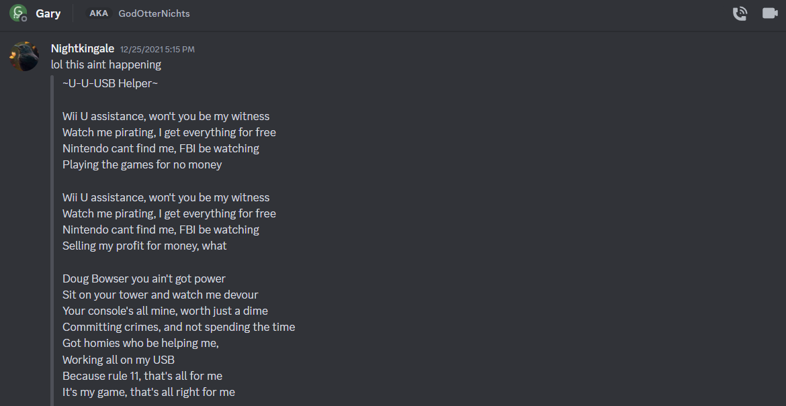
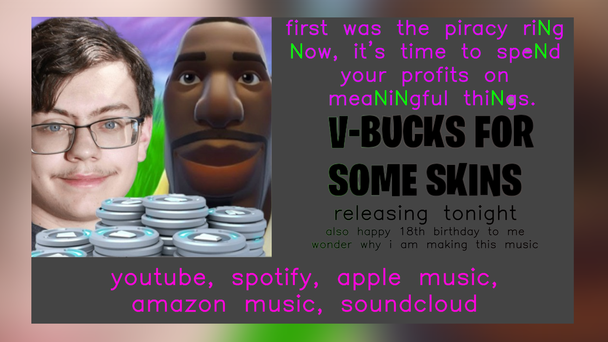
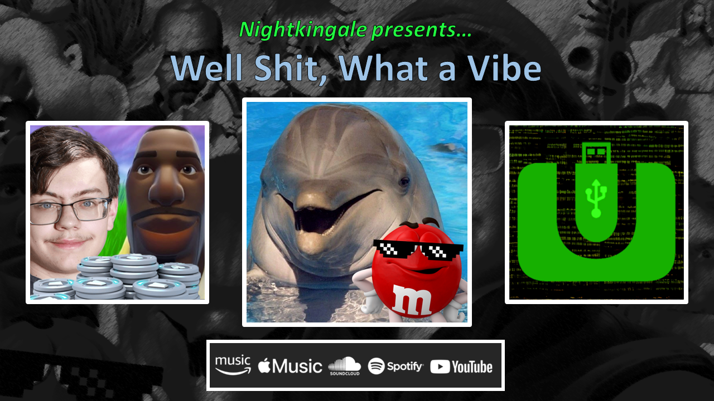

# Origin Story of Nightkingale

I've been wanting to write about all of this for quite a while. At some point I may or may not amend to this post with anything that comes up in the future. We'll see though! Let's start all the way back before I even began publishing my work.

## Before the Beginning

I've always joked about how [GaryOderNichts](https://github.com/GaryOderNichts), my good friend (and one-third of the Bad Time Trio), was responsible for my meme rapping antics. It's more than a joke though, it's an absolutely legitimate claim.

It all started back on Christmas Day of 2021. As most know, I used to be heavily invested in the Wii U hacking scene. I never left it necessarily, but I'm not as involved as I used to be anymore. One day, Gary and I were playing Fortnite to pass some time. We were talking about some Wii U stuff, I think the Wii U hacking guide, and it came up that somebody should make a Wii U hacking rap song.

You already know, I had to get to work on that! Three hours later, I came up with the very first iteration of the USB Helper rap song.

That was it for a long while, and I never did much with these lyrics afterwards... until sometime in late May 2022, where I began to write more joke songs.

At the time, there was a trend about rewriting songs to utilize the lyrics in "Low" by Flo Rida. I hopped on this train, and I made six more tracks, most of which were just parodies of classic songs. One notable track that I wrote however, was titled "Why You Gotta Be So Sus?"

This song was a parody of "Rude" by MAGIC! with Among Us lyrics. There's a few on YouTube nowadays that are the exact same thing, but the point is that this is what fueled the fire for the actual meme raps... almost.

## The Beginning of the End

At some point over the summer of 2022, I decided to record USB Helper, and it was my first track to ever hit any major streaming platforms. It was released under my old alias, NoahAbc12345. You won't find it anymore, because I delisted it from everywhere. I'll post it here though, if you're so curious to hear it.

    <audio controls>
        <source src="../assets/audio/usb_helper_original.mp3" type="audio/mpeg">
        Your browser does not support the audio element.
    </audio>

I actually got a copyright claim from the producer, [Anton Vlasov](https://www.youtube.com/channel/UCgphHnT94ZU_sbgA_Lw1SrQ). Truthfully, I took the beat and recorded over it because I was under the impression it was royalty-free. However, that wasn't the case. From then on, I decided I would only use beats I produce myself!

After that, sometime that October, I decided to move on to my next music related project, called *The Beginning of the End*, which has a lot of tracks that might look familiar.

You'll notice that "V-Bucks for Some Skins," "Wii U USB Helper," "Fuego, No Hielo," and "Lost Without Trust" all are here! A lot of these tracks I've released have been planned ever since the beginning, and are still gradually being released, even with the *Heavenly Night* album!

I originally wanted to release this project as my debut album on my 18th birthday (being January 3rd, 2023). Ultimately, time constraints caught up to me, and I quickly grew tired of working on this project. For now, I scrapped every single track in this album, except for one... Take a guess!

## The Actual Beginning

By this point, I originally planned to release only three songs and call it quits. These were "V-Bucks for Some Skins," "Wii U USB Helper," and one more brand new track I would write, which eventually became "Well Shit, What a Vibe." I've always called these three the original *Meme Trilogy*.

### V-Bucks for Some Skins
> We like Fortnite, yes, we like Fortnite. (01/03/2023)

This was the sole survivor of the great *Beginning of the End* cut for a long while. This was actually one of the final tracks I recorded for the scrapped album, drafted sometime back in November 2022.

Back then, I had originally wanted to call it "Fortnite Skins," but I renamed it to a phrase that actually appeeared in the song.

I was very addicted to Fortnite at the time, so I conveyed that through this track. In particular, I was deeply inspired by the Pokérap of all things, and I wanted a verse or two to recreate that same feeling. I just picked a bunch of random Fortnite skins and wrote a verse rapidly naming them!

Fun fact also, this track was the only track recorded with my old equipment before I upgraded. The released version has quiet vocals, and it has always bugged me. I have since mixed a remastered version which rectifies the issue, but I have yet to find a way to release it.

### Wii U USB Helper
> Fuck Nintendo, and FailedShack for the win. (02/04/2023)

I seriously wanted to remake this track after I took it down. After all, it's my magnum opus. I started working on this remake shortly before the release of "V-Bucks for Some Skins," and I even added more to each verse and the chorus.

Since its February 2023 release, it has grown to be my most successful single, factoring in all the plays and engagement it received. I can tell a lot of people enjoy this one, I don't even blame them! It's a Nightkingale classic.

### Well Shit, What a Vibe
> Don't do drugs, kids. Stay in school. (03/02/2023)

Just like last time, I started drafting this track shortly before the release of "Wii U USB Helper." At first, I considered the idea of making an extremely dark song, discussing drug abuse and other issues. In the end, I decided against this, and I rewrote the song with a slightly more lighthearted tone.

I try to connect a lot of my meme raps together, and even though I didn't plan on making anything after this one, I thought about setting up a story. I've referred to this before as the "N lore."

For example, the idea in this song is that the person bought drugs (dubbed M&Ms on the track) from an unknown dealer and manages to get high off them. In the *Heavenly Night* album, I reveal that the dealer is none other than El Chapo. There are some more vague references between tracks, but this one is probably one of the most obvious ones.

I also originally tried to sample a Poison Control Center PSA for the beat in this track. However, I wasn't able to get it cleared, so I had to scrap that idea.

After this track released in March 2023 though, I announced I was finished making tracks. However, I had amazing support on all three of the tracks. After some time away from writing songs, I began to plan my return.

## A Cliffhanger for Now

That's all for this post! I'm eventually going to follow this up, and I'll be talking about the rest of the tracks, including "I'm on My Tractor," "Shopping for Free," as well as all the tracks in the *Heavenly Night* album.

Stay tuned for the other half of the story! I hope you're excited!