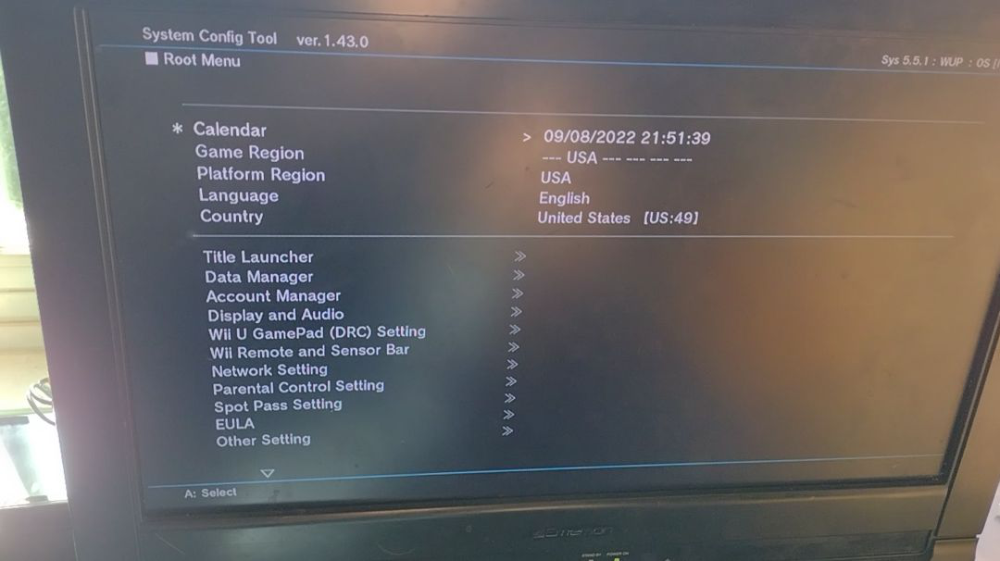
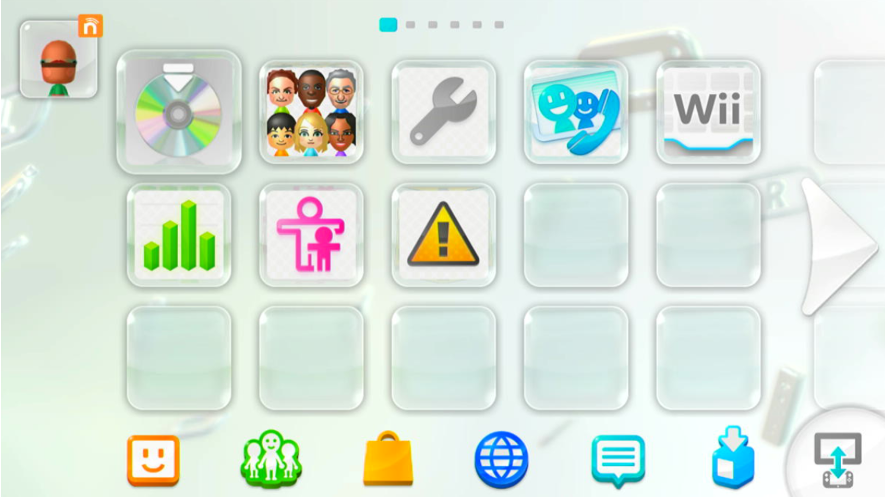
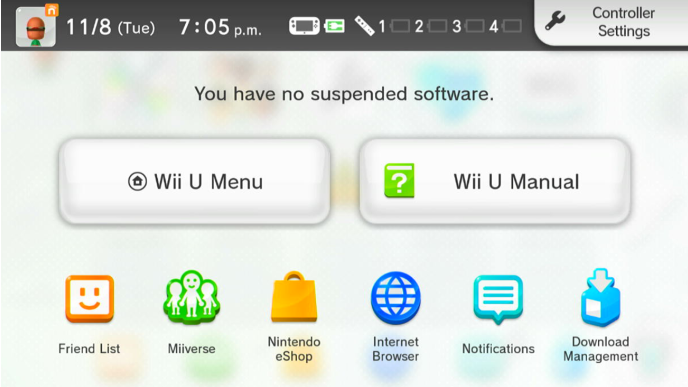
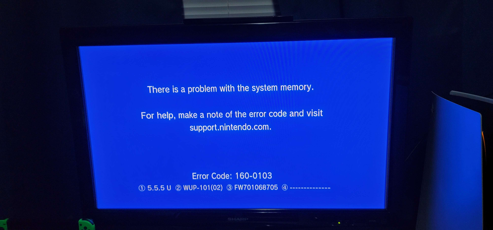
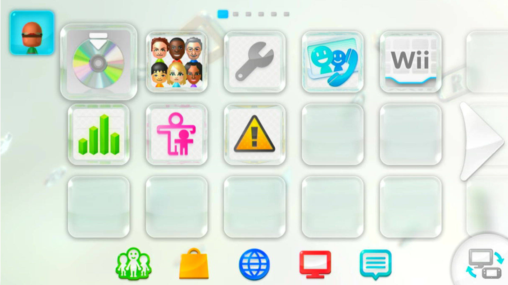
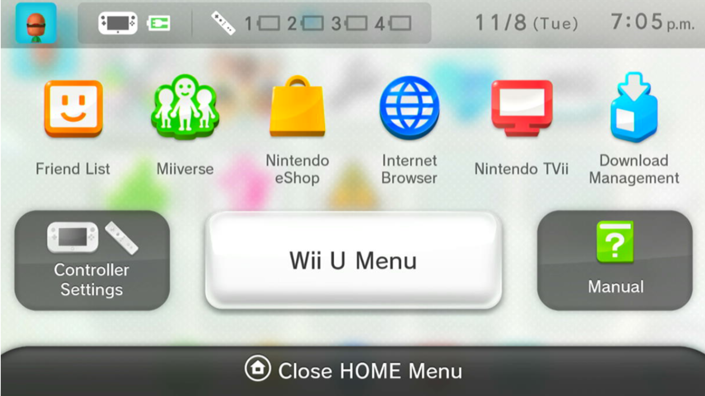

# The Downgrade of Doom

Before you continue reading, do **not** take anything I outline in this post lightly!

Downgrading to a lower firmware is a cool novelty, but it has no practical use! If you feel so inclined to replicate what I did, please be very cautious. There is a serious risk to the console!

When I talk about downgrading on Wii U, I think back to a few years ago when people would downgrade their Internet Browser for access to homebrew. It had a use at the time, but nowadays we have so many exploits and custom firmwares that there's no need for that anymore.



It seems silly to the ordinary hacker to want to downgrade. On the contrary, I am very interested in weird and unusual things like this.

## Inspiration for This Stuff

I tend to experiment more on the side of Nintendo Wii and vWii stuff now, but that isn't to say I've had my fair share of fun on the Wii U side. I happened to stumble upon that video about the Internet Browser a few days before my endeavors.

In the video, [Riccardo Boninsegna](https://www.youtube.com/channel/UC3yLQv_WnKLgbUlGAKUllrw) summarizes what downgrading is like on the Internet Browser, but I began to wonder if we could go deeper.

I also remember a now-deleted video by another YouTube channel, [Quick Bell Hacker](https://www.youtube.com/c/QuickBellHacker), showcased downgrading to a lower version in order to restore easy access to Nintendo TVii.

The issue with that video is there was no real explanation. A lot of people were left curious, which leads them to test things they probably shouldn't be. On top of that, it seemed to involve Nintendo SDK tools that most people won't legally have access to, like the System Config Tool.



Despite the beef that they have with me for whatever reason, I must give credit that Quick Bell Hacker is the first person I know of to successfully downgrade their Wii U Menu. However, I don't think it was fair for so many people to be left confused the way that video did, so I got together with two of my best friends to replicate it.

## Time for the Main Event

I teamed up with [Lazr1026](https://github.com/Lazr1026) and [GaryOderNichts](https://github.com/GaryOderNichts), both of whom I'm very thankful to call friends. In Lazr's own words, we're The Bad Time Trio!

Lazr did a great deal of experimenting alongside me, testing things I couldn't and doing a lot of the risky work. Gary helped us with the technical stuff, like reverse engineering when we were both stuck. Without them, I couldn't see this happening, so thank you both!

This is a picture of the current Wii U Menu and HOME Menu, which we want to move from.




The most effective way to downgrade is through Gary's [UDPIH](https://github.com/GaryOderNichts/udpih) exploit. I had purchased a Raspberry Pi Pico back when I tested UDPIH before its release, and I still find a lot of use out of it today.

Assuming all is well, we'll have access to the [Wii U Recovery Menu](https://github.com/GaryOderNichts/recovery_menu). We can now access the console early on enough where we can mess with things like the Wii U Menu in a "safe" manner. This menu has an option called `Start wupserver` that will allow us to connect with [wupclient](https://raw.githubusercontent.com/FIX94/iosuhax/master/wupserver/wupclient.py).

Right off the bat, I noticed that trying to install a Wii U Menu WUP of a lower version than the currently installed one doesn't work. It seems as if IOSU doesn't like that, which is completely fair. That means we need to eliminate the currently installed version. We have to do this manually, because I found that uninstalling it through wupclient doesn't work.

You'll need to know the title ID for the application, so check the [title database](https://wiiubrew.org/wiki/Title_database) on WiiUBrew!

Using that, if you want to delete the North American region Wii U Menu for instance, run this.
```
w.rmdir("/vol/storage_mlc01/sys/title/00050010/10040100")
```

Wait though! That won't work either, because wupclient will complain the directory isn't empty. That means we'll need to use a modified version of wupclient.py. If you open up the file, you can change the `rmdir()` function to match mine.

```
def rmdir(self, path):
    fsa_handle = self.get_fsa_handle()
    if path[0] != "/":
        path = self.cwd + "/" + path
    ret, dir_handle = self.FSA_OpenDir(fsa_handle, path)
    if ret != 0x0:
        print("rmdir error : could not open " + path + " (" + hex(ret) + ")")
        return
    self.FSA_CloseDir(fsa_handle, dir_handle)
    if len(self.ls(path, True)) != 0:
        entries = self.ls(path, True)
        for e in entries:
            if e["is_file"]:
                print("deleting: " + e["name"])
                self.rm(path + "/" + e["name"])
            else:
                print("deleting: " + e["name"] + "/")
                self.rmdir(path + "/" + e["name"])
    ret = self.FSA_Remove(fsa_handle, path)
    print("rmdir : " + hex(ret))
```

If you run the command again, wupclient will start deleting all of the files inside of the directory, and then the directory itself. If you try to reboot at this point, you'll most likely find you can't. The Wii U Menu is gone now!

I had an out-of-date Wii U Menu WUP loaded onto my SD card, which I got from [JNUSTool](https://github.com/Maschell/JNUSTool). Nintendo's servers seems to carry almost every version of system title, so if you'd like to grab some packages, I'd recommend looking into that.

By running the `install_title()` command and passing my Wii U Menu WUP as an argument, we should hopefully see wupclient return `0x0` if the install was a success!

In my own case, I installed the earliest version I could find, so I ran this command.
```
install_title("install/tmp_0005001010040100_v24")
```

After all this, we still have one more step. Both Lazr and I were stuck because we kept on failing to boot. We got an error, being 160-0103. I even managed to get the error screen to be blue!



We still had access to UDPIH, so we could dump our logs at least. We found that the boot process returned a very unhelpful code, `-262227`. We couldn't figure out what to do with it. Gary, the God of the homebrew scene himself, had an idea.

After some reverse engineering that he made look incredibly easy, Gary concluded that we needed to edit a file, located at `/vol/system_slc/security/versions.bin`. For the sake of my own time, I ended up deleting the entire file. However, one should take the time to [edit it properly](https://gbatemp.net/threads/how-to-edit-the-versions-bin-tutorial.601092) since it might be important to keep.

Since I was on a testing unit and I knew the file would regenerate, I just ran this.
```
w.rm("/vol/system/security/versions.bin")
```

We're set! To my surprise, we didn't have to do anything further. We could reboot and properly access our newly-installed but out-of-date Wii U Menu!




This method can be applied to more than just the Wii U Menu. The HOME Menu is actually a seperate application, and as I've shown in my screenshots, it can be downgraded the same way. Other applications like System Settings can also be downgraded, so it seems like almost anything is on the table.

Keep in mind that very crucial titles like OSv10 should be kept as is. I haven't messed with downgrading it, and that's for good reason. If it breaks, there is no easy way to fix it. I haven't found any reason I would need to yet anyway, so use your best judgement.

Another thing to note is that there will be issues! This should not be used as a daily driver at all! Neither Aroma or Tiramisu work well from my experience, and I needed to revert my system titles back to the latest version in order to continue using them without bugs.

In order to revert this downgrade, there are two ways.
* The reliable method, through the System Updater if you can make it detect an update (downgrade the VersionData title).
* The manual method, installing the latest packages of every title you downgraded (which should be much easier to do).

## What This All Means

This means absolutely nothing, aside from the fact that it's possible. If you'd like to re-experience a bit of nostalgia like I wanted to, this would probably be a bit of fun. Just keep in mind that there's almost zero pros and very many cons when considering doing this.

At the same time as this post going live, Lazr has also released a page on Wii U region-changing. Unlike this post, her's is a guide rather than a write-up. Even so, I feel like this and that are in conjunction, so I highly recommend you give it a read [here](https://lazr1026.github.io/regionchange) if you're interested!

Again, even though this is extremely dangerous, it makes me wonder if we could ever safely do this in the future. If SDCafiine ever picked up code-patching, could we do this I wonder? We'll just have to wait and see I guess!