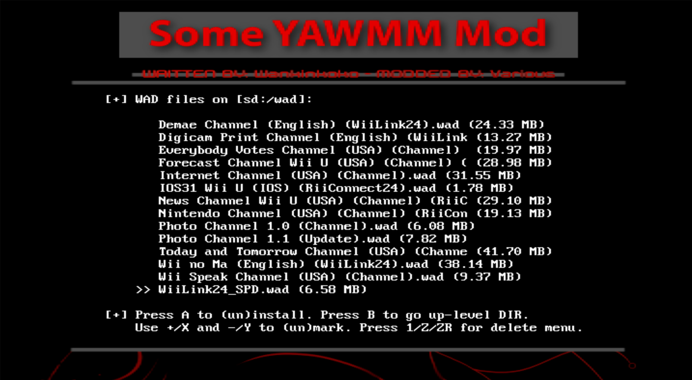
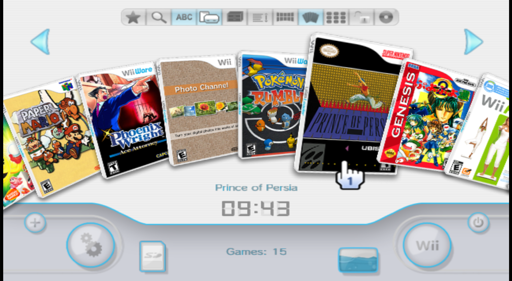
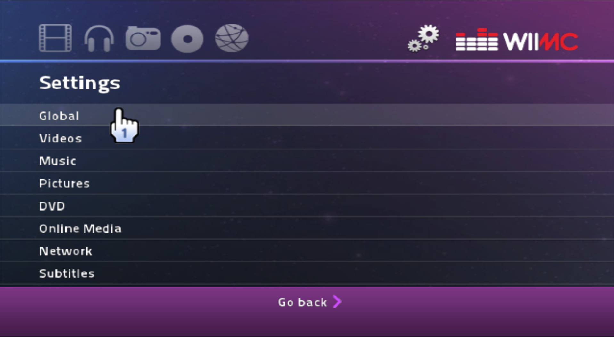

## Essential Wii/vWii Homebrew

The Nintendo Wii is notable for having a massive community that supports the console with homebrew, even after Nintendo discontinued most Wii-related services.

On top of that, the Nintendo Wii U has a very accurate backwards-compatibility mode, meaning that you can run many of the same things on a Wii U as you can on a Wii! That even includes homebrew!

If you want to modify your Wii, follow the [Wii guide](https://wii.guide). For modifying your Wii U, check out the [Wii U hacking guide](https://wiiu.hacks.guide), then see the [vWii modding guide](https://wiiu.hacks.guide/#/vwii-modding) after. 

Lastly, for the sake of consistancy, I will only be compiling my favorite homebrew which works on both Wii and vWii. Sorry, Priiloader!

### Some YAWMM Mod

This homebrew is probably the best WAD manager. There's other ones out there like Wii Mod Lite or WAD Manager, but this one is optimized for vWii support, and it's also open-source!

This will allow you to install forwarders, homebrew, and even official channels and games, just as the Wii Shop Channel would!

Check out the [GitHub page](https://github.com/FIX94/Some-YAWMM-Mod) for the source code and downloads!

### USB Loader GX

This homebrew is essentially the definitive game loader for Wii and vWii. It allows loading for all of your installed channels like the Wii Menu, but it even allows you to load backup copies of your Wii and GameCube games!

You can plug in a hard drive, dump your favorite games to it, and then play them digitally, all through this one program!

Check out the [SourceForge page](https://sourceforge.net/projects/usbloadergx) for the source code and downloads!

### WiiMC

The Wii was originally going to be much more than a gaming console. There was meant to even be support for DVD playback! The hardware makes it perfect for a media center, which WiiMC strives to do.

You can even plug in a disc reader and watch DVDs, even if you're using vWii or a traditionally unsupported Wii model. [It's pretty cool, take a look!](https://www.youtube.com/watch?v=w6Ut7rgPZfo)

Check out the [GitHub page](https://github.com/dborth/wiimc) for the source code and downloads!

