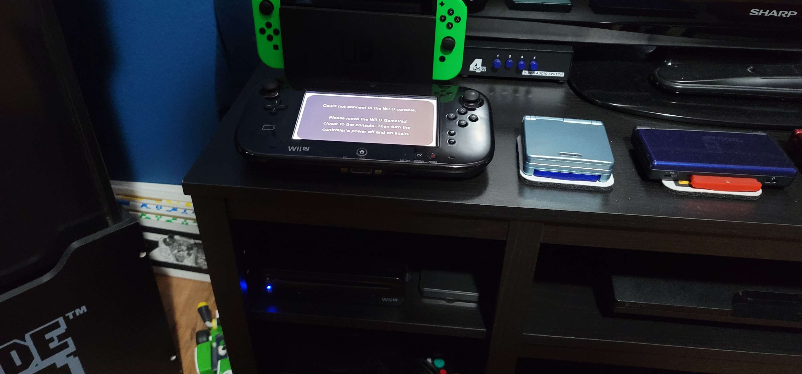
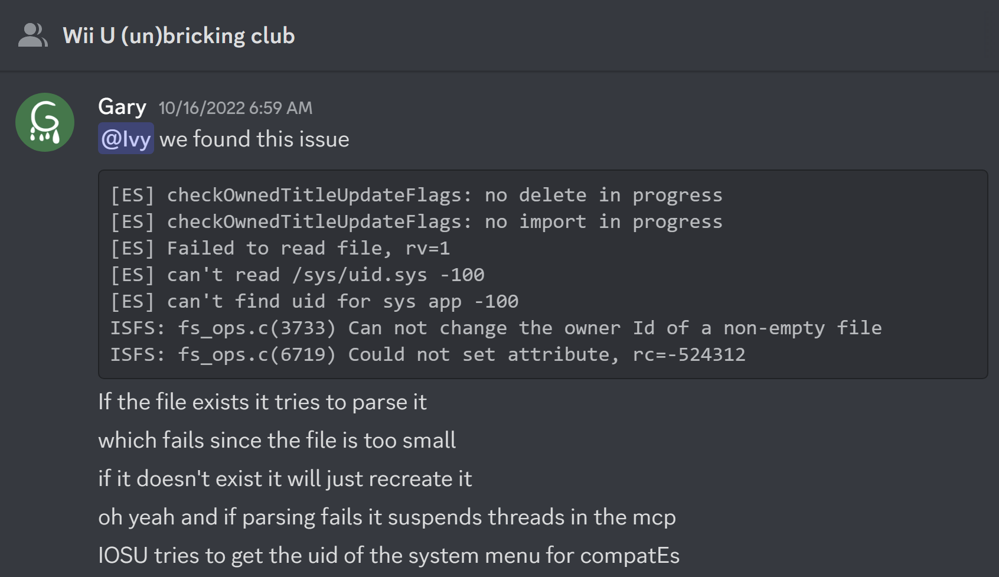
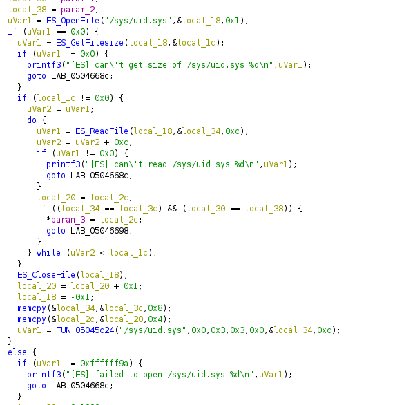

## Wii U Caught Slacking

Back when I was active on the Nintendo Homebrew server, I witnessed many people who had bricked their Wii Us in the most interesting ways.

One person wiped every file in their vWii NAND by curiously clicking a few buttons they probably shouldn't have. Another, many actually, messed with system titles like Mii Maker, especially back when the [FST pointer vulnerability](https://github.com/Rambo6Glaz/FST_patcher) was leaked to the public.

Nowadays, I would argue that Wii U hacking is much safer overall. There's still some risky stuff being recommended, such as a somewhat recent Sthetix video that promotes modifying system files.



None of this is anywhere near as dangerous as what I happened to do to my own console.

### I Did a Little Trolling

I got really bored. I assumed that the worst that could happen to my vWii is that it wouldn't boot anymore. A tool like vWii Decaffeinator could restore things back should something go wrong, or I can just supply a NAND backup.

Alright, no big deal I guess. I'll just restore an old backup I made of my vWii NAND.

It turns out that if you don't want your Wii U to turn on ever again, just replace the vWii `/sys/uid.sys` file on the NAND with a singular byte.

Why did I do it? A joke.

### A Well-Deserved Brick

To make it clear, I actually have two Wii Us. One of which is much more loved than the other, but both are cared for enough to be named. I don't know why I named them either, but the idea just happened to stick with me for these two consoles in particular.

* Big Bertha, my daily driver. This one is the console I've been using since at least 2014, if not earlier. I've really grown up with this one.
* Shaniqua, my testing unit. This one is where I do all the risky things, such as the Downgrade of Doom, which I covered in an earlier post.

Can you guess which one I bricked? If you said Shaniqua, you're wrong.

I would argue that I have very much more experience exploring the Wii side of things compared to the Wii U. I genuinely thought nothing could go wrong by messing with this file. Curiosity kills the cat, I guess!

### Nintendo Sucks at Coding

As usual, the rest of the Bad Time Trio, [GaryOderNichts](https://github.com/GaryOderNichts) and [Lazr1026](https://github.com/Lazr1026), came to save the day!

Despite my best efforts, I am not at all good at reverse-engineering stuff, let alone the IOSU. This is a very brief explanation from Gary about what happened when he replicated it on his console equipped with isfshax.

As I understand it, Nintendo didn't quite account for every scenario. If `/sys/uid.sys` doesn't exist, it will be created on boot. However, if it does exist but isn't large enough, it will try to parse it and look for a byte which doesn't exist. They probably didn't think about this because it shouldn't normally be possible for the file to be a single byte. However, if it was to happen, that entire thread would stop and leave the console hanging.

It's quite scary how such a small oversight could be so devastating! I wasn't sure what I was expecting when messing with system files, but it crashed the console so early in the boot process that even the boot logo didn't show up.

### UDPIH Saves the Day

After the brick happened, I woke up very early the next morning to start brainstorming. Gary and I sat in a voice chat on Discord and bounced ideas off each other.

Nowadays, [UDPIH](https://github.com/GaryOderNichts/udpih) will be the savior of almost all bricks that happen on Wii U, granted you aren't messing with the IOSU. The issue is since it crashed too early, UDPIH wouldn't work. Thus, he started to code a modified version of UDPIH and the recovery_menu, which served no purpose other than to delete `/sys/uid.sys` on the vWii NAND.

Thankfully, it worked after a decent amount of trial and error! I replaced the file on the Wii U side with a backup I had made before the brick occurred, and everything worked great! I was so happy to not have lost any of my save data in Mario Kart, Super Smash Bros, Pokémon, or anything else.

I would really like to share the modified files which had fixed my brick, however I won't be hosting them on this site for now. In the future, I may host this and other files on a OneDrive, but if you see me around on Discord, I'd be more than happy to send you what I have.

### That's All She Wrote

All in all, it would technically be possible to brick your entire Wii U just from the vWii side. Honestly, it's pretty frightening to think about. That being said, don't mess with system files! This is what happens when you do!

Sadly, this isn't the first time I've had to have been bailed out of situations like this by Gary or Lazr or anybody else. I'll write about those stories at a future date, especially the brick that happened right before I ate a firework!

For now though, I'm eternally grateful to all the friends I've made in this adventure so far, and I sincerely hope that we can continue forth with another great year in the homebrew scene.